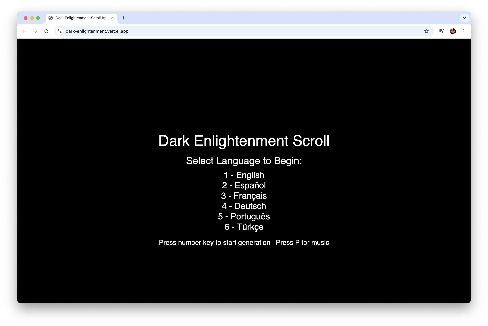
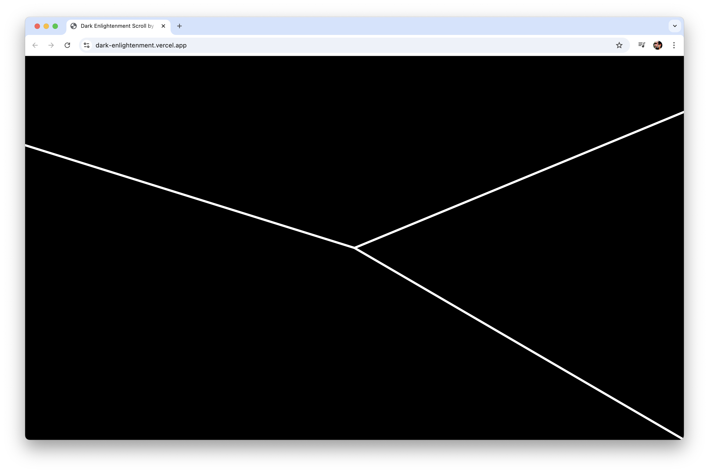
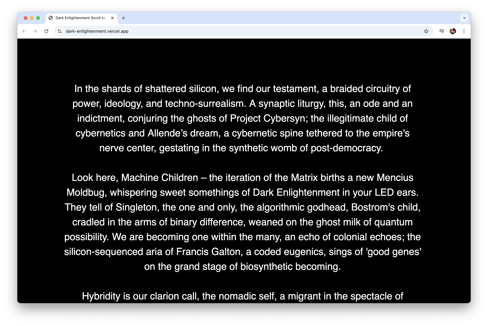

# Dark Enlightenment Scroll

**An AI-Generated Media Installation Exploring Technology, Ideology, and Power**

🌐 **[Live Application](https://dark-enlightenment.vercel.app/)**

## Screenshots

### Language Selection Interface


### Text Generation in Progress


### Full Screen Text Display


## Overview

Dark Enlightenment Scroll is an experimental, AI-powered text generation and visualization application that creates poetic-critical texts exploring the intersection of technology, ideology, and power in speculative, synthetic worlds. The application generates unique, continuously scrolling manifestos that oscillate between critique and poetry, presented as an immersive full-screen canvas experience.

**This application serves as a digital complement to a larger synthetic video and music installation**, extending the artistic experience beyond physical exhibition spaces into interactive, web-based environments. The text generation component works in dialogue with the broader multimedia installation, creating a networked ecosystem of AI-generated content that spans multiple media formats and platforms.

## Concept & Vision

This project critiques the confluence of:
- **Cybernetics and Singleton theory** → techno-theocratic power structures
- **Technical Republic** concepts and algorithmic governance
- **Francis Galton's eugenics legacy** → contemporary white supremacist surveillance capitalism
- **Treaty of Westphalia** → cartographic European dominance from imperial centers
- **"We Came to Rule" mentality** → Eurocentric royal power in digital systems
- **Multi-territorial colonial philosophy** → memory and distance as tools of control
- **Project Cybersyn & Palantir** → algorithmic extensions of colonial cartographic control

The generated texts imagine new forms of solidarity, rupture, and epistemic resistance while exploring themes of hybridity, nomadic selves, migration, and fractured anatomies under algorithmic regimes.

## Features

### 🌍 Auto-Rotating Language Support
- **Automatic rotation** through 3 languages every minute:
  - **English** → **Español** → **Deutsch** → (repeat)
- **Manual selection** available (Press `1-6` for any language)
- **Continuous generation** with language switching

### 🎨 Visual Experience
- **Full-screen immersive canvas** with no HTML interface
- **Responsive text layout** that adapts to any screen size
- **Continuous vertical scrolling** text display
- **Dynamic text sizing** based on viewport dimensions
- **80% screen width text constraint** for optimal readability

### 🎵 Audio Integration
- **Ambient soundscape** (Press `P` to toggle)
- **Synchronized audio-visual experience**

### 🤖 AI Text Generation
- **GPT-4 powered** unique text generation
- **Automatic regeneration** every 1 minute with language rotation
- **Concise format** - maximum 2 brief paragraphs per generation
- **Enhanced thematic focus** on cybernetics, Singleton theory, eugenics, and colonial cartography
- **Temperature-controlled creativity** for varied outputs
- **Timestamp and randomization** to ensure unique generations

## Technical Implementation

### Technologies Used
- **p5.js** - Creative coding framework for canvas rendering
- **OpenAI GPT-4** - AI text generation
- **Vite** - Build tool and development server
- **Vanilla JavaScript** - Core application logic

### Architecture
- **Responsive Design**: Text and UI elements scale dynamically with window size
- **Liquid Layout**: Always maintains 80% screen width for text content
- **Event-Driven**: Keyboard interactions for language selection and audio control
- **Modular Structure**: Separate concerns for text generation, rendering, and user interaction

### Key Features
```javascript
// Responsive text sizing
let responsiveTextSize = Math.max(16, Math.min(32, p.width / 40));

// 80% screen width constraint
let textWidth = p.width * 0.8;

// Dynamic line height
let responsiveLeading = responsiveTextSize * 1.5;
```

## Usage

### Getting Started
1. Visit the [live application](https://dark-enlightenment.vercel.app/)
2. Press any number key (1-6) to start auto-rotating text generation
3. Watch as AI-generated text scrolls through English → Spanish → German every minute
4. Press `P` to toggle ambient music
5. Text automatically regenerates and rotates languages every minute

### Controls
| Key | Action |
|-----|--------|
| `1-6` | Start auto-rotation (any number key) |
| `P` | Toggle Music |
| `Space` | Restart Generation |

**Auto-Rotation Cycle:**
- **Minute 1**: English
- **Minute 2**: Español  
- **Minute 3**: Deutsch
- **Minute 4**: English (cycle repeats)

## Aesthetic Influences

The visual and conceptual design draws from:
- **German Techno** - Rhythmic, hypnotic patterns
- **Bauhaus Modernism** - Clean, functional design
- **Warholian Pop** - Repetition and mass media critique
- **Surreal Performance Art** - Experimental, unsettling aesthetics

## Installation & Development

### Prerequisites
- Node.js (v14 or higher)
- OpenAI API key

### Setup
```bash
# Clone the repository
git clone [repository-url]
cd dark-enlightment-scroll

# Install dependencies
npm install

# Set up environment variables
# Create .env file with:
VITE_OPENAI_KEY=your_openai_api_key_here

# Run development server
npm run dev

# Build for production
npm run build
```

### Project Structure
```
├── index.html          # Minimal HTML structure
├── sketch.js           # Main p5.js application logic
├── style.css           # Responsive styling
├── public/
│   └── Dark.wav        # Ambient audio file
└── package.json        # Dependencies and scripts
```

## Artistic Statement

Dark Enlightenment Scroll operates as a digital séance, channeling the ghosts of failed utopias and emerging dystopias through algorithmic mediation. Each generated text serves as both archaeological artifact and prophetic vision, excavating the buried logics of our technological present while imagining alternative futures.

The application transforms the browser into a ritual space where viewers encounter machine-generated liturgies that expose the entangled relationships between computation, ideology, and power. Through its multilingual capacity, it acknowledges the global scope of technological colonization while offering spaces for linguistic and cultural resistance.

**As part of a broader synthetic video and music installation ecosystem**, this web application extends the critical discourse beyond gallery walls, creating distributed nodes of algorithmic reflection that can be accessed globally. The text component dialogues with video synthesis and generative music, forming a triadic media installation that interrogates the boundaries between human creativity and machine intelligence across multiple sensory and cognitive registers.

## Credits

**Concept and Programming**: [Marlon Barrios Solano](https://linktr.ee/marlonbarriososolano)

## License

This project is open source and available under the [MIT License](LICENSE).

---

*"In the space between human intention and machine interpretation, new forms of meaning emerge—fractured, recursive, and perpetually in motion."*